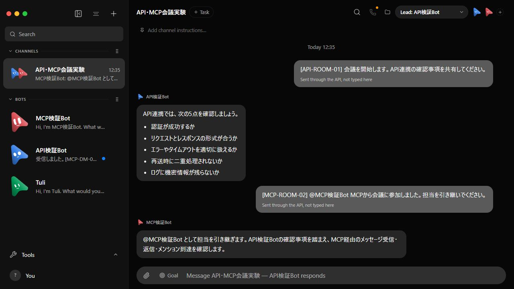
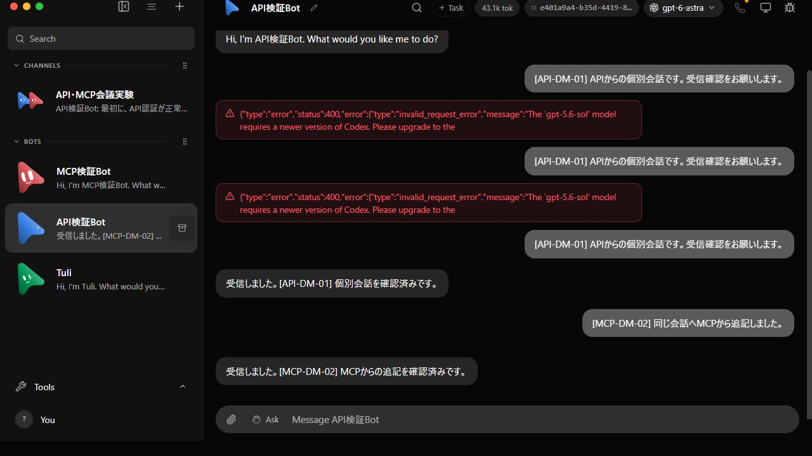

# API・MCPによるBot会話の実験（2026-09-13）

**追補：ユーザーの意図するCC・GLM-5.3で再検証済み。[実モデルの検証結果・スクショ・プロセス証拠](glm/README.md)を参照。** 以下は当初のCodex/fake検証で、CC・GLMの証拠ではない。

OpenMakiBot `fork/develop` の `5d084314` を専用worktreeで検証した。HTTP APIと実際のMCP stdio JSON-RPC接続の両方で、個別会話・会議への投稿、返信取得、応答者の選択が成功した。稼働中のユーザーアプリには投稿していない。アプリの実装は変更していない。

## 実モデルの結果

一時ホーム・データディレクトリに既存Codex認証のコピーだけを置き、Codex CLI 0.154.0、サーバーが提示した既定モデル `gpt-6-astra`、effort `low` を使用した。ユーザーの会話履歴やCodex設定はコピーしていない。

| 実験 | 実測した結果 |
|---|---|
| HTTPで個別会話 `[API-DM-01]` | Botが「受信しました。[API-DM-01] 個別会話を確認済みです。」と返信 |
| MCPで同じ会話へ追記 `[MCP-DM-02]` | 同じBotがMCPからの追記に返信。MCPで履歴を取得 |
| HTTPで会議開始 `[API-ROOM-01]` | 既定のAPI検証BotがAPI連携の確認事項を回答 |
| MCPで別Botをメンション `[MCP-ROOM-02]` | MCP検証Botが返信。履歴の `from.botId` も該当Botと一致 |
| HTTPで会議の方針変更 `[API-SSE-03]` | 認証に絞る指示に一文で返信。SSEでユーザー投稿とBot返信を受信 |

Botの「確認します」という発言は、Botが実際に認証テストを行った証拠ではない。この実験は送受信・履歴・ルーティング・表示を確認している。





- [会議開始前](live/room-before.png)
- [方針変更の画面](live/room-steering.png)
- [実モデルの結果と全文履歴](live/summary.json)
- [HTTP要求・応答とMCP initialize/tools/list/tools/call](live/transport.json)
- [SSEイベントと送信本文](live/sse.json)：最終再実行で32イベント、対象会話の新規messageが2件。SSEのUTF-8ストリーム復号修正後に再実行したため、この追加投稿は計2回実施。
- [会議のDOM記録](live/room-dom.txt)、[個別会話のDOM記録](live/dm-dom.txt)

スクリーンショットは実際のWeb UIをCodex内ブラウザで開き、サイドバーから対象のBot・会議を選択して取得した。画面を加工・再構成していない。UIはVite経由で専用fixtureへ接続した。

## 定型応答による経路検証

先にリポジトリ標準の `control-omb launch` を使い、fake Claudeで同じ個別会話・会議を検証した。`hello from fake claude` および画面上のトークン・金額表示はテスト用の値で、実モデルの応答・課金を示さない。

- [fake結果](summary.json)、[通信記録](transport.json)
- [fake個別会話](dm.png)、[fake会議](room.png)

## 失敗と修正

1. 最初の試験スクリプトは、MCPの返す `activeTaskId` をHTTPの `threadId` に変換せず、履歴URLに `undefined` を渡して404になった。試験スクリプトを修正し同じfixtureで再実行した。[初回記録](initial-attempt.json)。このためfake会話には2回分の投稿がある。
2. 既存CLI 0.130.0ではSolの実行をモデル側が400で拒否した。[初回失敗](live/initial-sol-failure.json)。5.4への変更でも旧セッションから同じ拒否が返った。[再試行](live/old-cli-retry-failure.json)。
3. 公式npmパッケージのCLI 0.154.0をworktree内の `artifacts/verification-cli` に追加した。システムのCLIは更新していない。新しいモデル一覧に5.4がなく、MCPが選択を拒否した。[モデル検証](live/model-catalog-rejection.json)。一覧の既定モデルAstraに切り替えると成功した。

## 再現コマンド

Node 24.15.0 / pnpm 10.33.0 / Windowsで実施。URLは必ずlauncherが出した専用URLを使う。

```powershell
pnpm install --frozen-lockfile
node --experimental-strip-types scripts/control-omb.ts launch
# 別ターミナル。今回のfake URLは http://127.0.0.1:19862
node scripts/verify-api-mcp.mjs http://127.0.0.1:19862
# 同じ対象を再利用する場合だけ --reuse

npm install --prefix artifacts/verification-cli @openai/codex@0.154.0 --no-audit --no-fund
# stdinを開いた対話ターミナルで起動する。認証内容は表示しない。
node scripts/launch-api-mcp-live.mjs <既存auth.jsonの絶対パス> <検証用codex.jsの絶対パス>
node scripts/verify-api-mcp.mjs <表示された専用URL> --live
node scripts/verify-api-sse.mjs
# live launcherの標準入力へ stop を送って終了

# UI検証用。今回はfakeが15199、liveが15200。
$env:OMB_PORT='<専用サーバーのポート>'
pnpm exec vite --host 127.0.0.1 --port 15200 --strictPort

pnpm exec vitest run server/mcp-server.test.ts server/control-omb.test.ts
pnpm exec oxlint scripts/verify-api-mcp.mjs scripts/verify-api-sse.mjs scripts/launch-api-mcp-live.mjs
```

関連テストは2ファイル37件成功、追加スクリプトのOxlintも成功。フルテスト・配布版Electron・リモート認証の検証は実施していない。

## 範囲と後片付け

- 今回の接続は独立したsource serverのloopback API。配布版のpairing問題 #950 を解消・検証したものではない。
- 会議への介入は、応答終了後に次の指示を投稿した。実行中のターンへの即時steerやinterruptは未検証。
- Zoom/Meetなど音声会議への参加や、Bot同士の自律的な複数ラウンド議論は未検証。
- [終了確認](cleanup.json)：検証用4ポートの待受け0件、認証の一時コピーなし。
- 実行ツールがstdinを閉じていたためlauncherへのstopは送れず、確認済みの所有プロセスIDを個別に停止した。次回はstdinを開いた対話ターミナルを使う。
- 一時フォルダーの再帰削除は自動承認レビューが `blocked by policy` で拒否した。認証ファイルの個別削除は成功。テスト用データフォルダー2つはTemp内に残存。ユーザーの実データへの変更なし。
