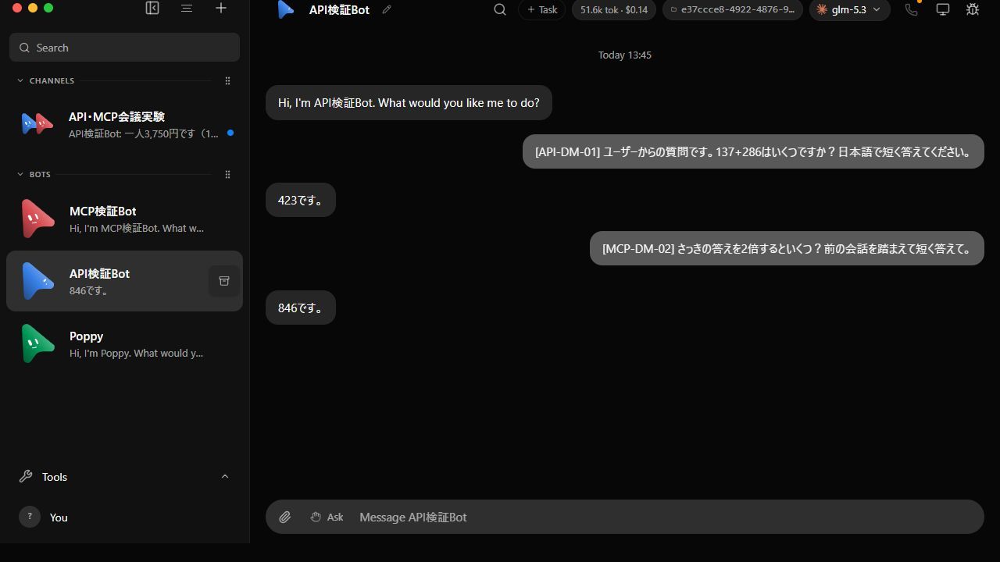
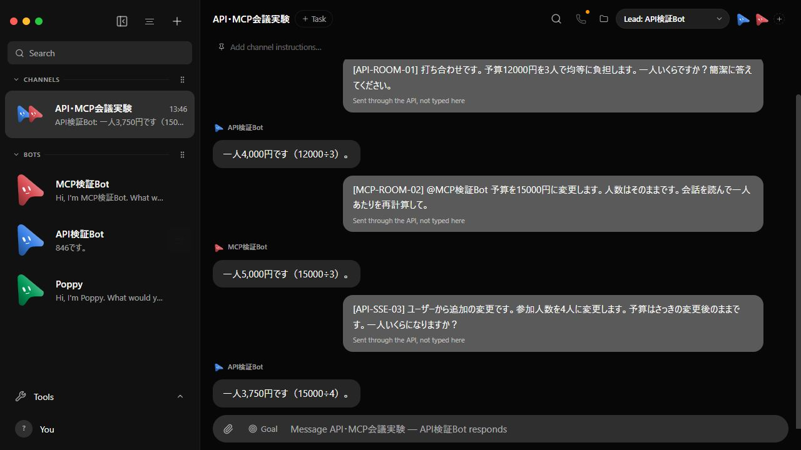

# ユーザーAPI → Claude Code → GLM-5.3 実機検証

2026-09-13 13:45–13:47 JST。前回のCodex/fakeの検証は、ユーザーが意図するCC・GLMを確認していなかったため、CC・GLMで検証し直した。この結果は前回と独立したデータ領域・Bot・会議に保存している。

**ユーザー役のHTTP/MCPクライアントが投稿し、Claude Code経由のGLM-5.3が回答する経路が成功した。** 全投稿が会話内の `role: user`、回答が `role: bot` である。GLMへ直接APIを呼ぶ試験ではなく、OpenMakiBotの通常の会話ルート・claudeAgentドライバー・実Claude Codeを通している。

| 送信経路 | ユーザーの質問 | GLMの実回答 |
|---|---|---|
| HTTP・個別 | 137+286はいくつ？ | 423です。 |
| MCP・同じ個別会話 | さっきの答えを2倍すると？ | 846です。 |
| HTTP・グループ | 12000円を3人で均等負担すると？ | 一人4,000円です（12000÷3）。 |
| MCP・別Botへメンション | 予算を15000円に変更。人数はそのまま | 一人5,000円です（15000÷3）。 |
| HTTP・同じグループ | 人数を4人に変更。予算は変更後のまま | 一人3,750円です（15000÷4）。 |

後続の質問では前の数値を繰り返しておらず、会話の文脈が渡ることも確認した。API投稿の受理だけでは合格とせず、MCP waitのsettled、返信本文の数値、グループの応答Bot IDをassertした。最後のHTTP投稿と返信はSSEでも受信した（50イベント、対象の新規messageは2件）。





## 実モデルの証明

- [設定と実行バージョン](fixture.json)：`claudeAgent`、実際の `claude.exe` 2.1.251、Z.ai既存接続先、`glm-5.3`。
- [実行中プロセス](process-proof.json)：所有サーバーの子の `claude.exe` 2件で、引数 `--model glm-5.3` と `stream-json` を確認。完全なコマンドラインや認証情報は保存していない。
- [Claude Codeの会話ログから抽出したモデル](provider-models.json)：assistantメッセージのmodelは8件すべて `glm-5.3`。回答Botの自己申告や画面ラベルだけを根拠にしていない。
- [HTTPおよび実MCP stdioの要求・応答](transport.json)、[個別・グループ履歴と検証結果](summary.json)、[SSE](sse.json)。
- [個別画面DOM](dm-dom.txt)、[会議画面DOM](room-dom.txt)、[サーバーログ](server.log)。

## 再現と分離

OpenMakiBot `fork/develop` のアプリ実装 `5d084314` を引き続き使用。検証用worktreeで以下を実施した。

```powershell
# 起動はstdinを開いた対話ターミナルで実行。
node scripts/launch-api-mcp-glm.mjs C:/Users/makim/.local/bin/claude.exe
# launcherが表示した専用URLを使用。今回のみ21357。
node scripts/verify-api-mcp.mjs http://127.0.0.1:21357 --glm
node scripts/verify-api-sse.mjs --glm
$env:OMB_PORT='21357'
pnpm exec vite --host 127.0.0.1 --port 15210 --strictPort
```

launcherは既存Podmanデータ内の `claudeZai` 設定を読み取り、必要なGLM接続環境だけを一時設定へコピーした。元の会話・Bot・設定は変更していない。個別・グループの5回答はすべて実CC・GLMで取得し、fakeやCodexへの切り替えはない。

標準fixtureを一時領域確保・cleanupに再利用しているため起動準備ではfake設定のサーバーが一度起動するが、そこには一切質問を送っていない。停止後にCC・GLM設定でサーバーを起動し直し、その実プロセスと回答を検証した。

ブラウザの実UIでBot・会議を選択して撮影。スクリーンショットの加工や再構成はない。関連テスト37件、変更スクリプトのOxlintが成功。

終了時にlauncherへ `stop` を送り、[一時データ削除完了](cleanup.json)を確認した。今回は一時認証設定も一時会話も残していない。配布版のpairing、実行中ターンの即時割り込み、音声会議への参加は今回の検証範囲外。
